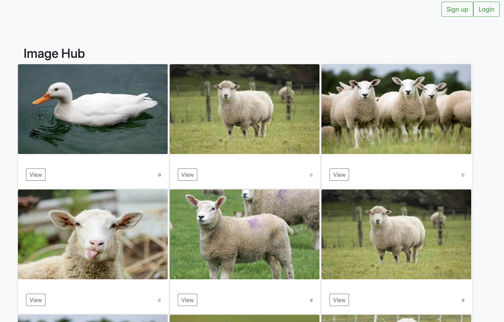
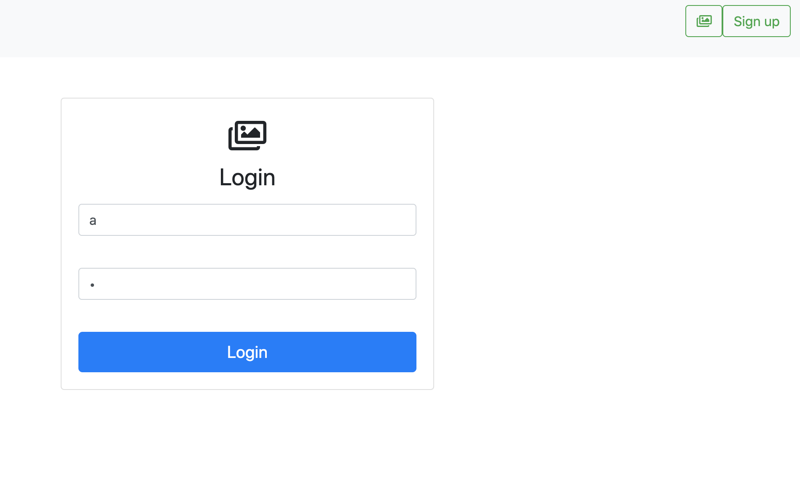
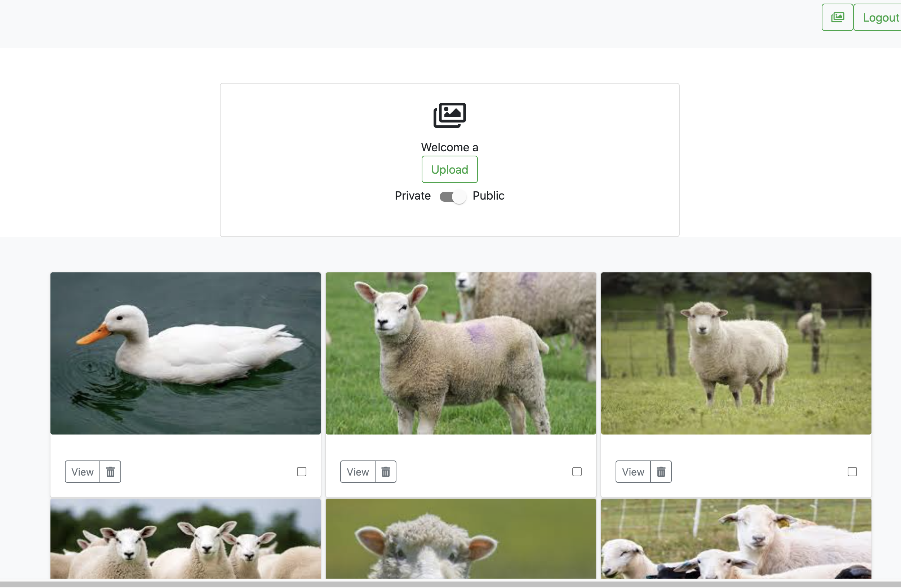
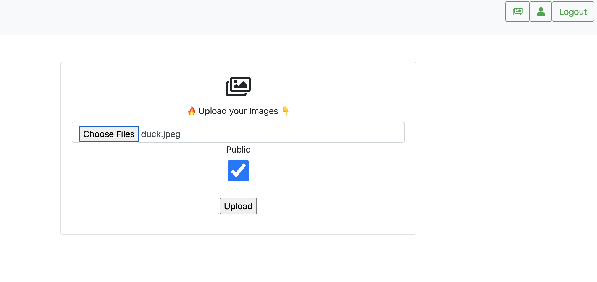
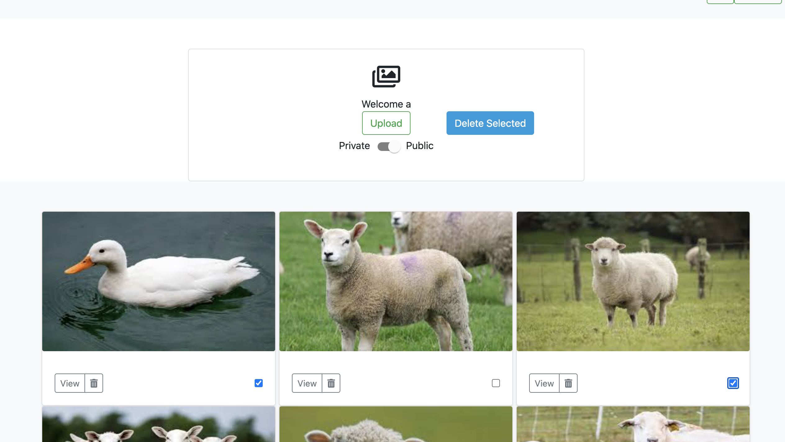

# Image Hub

A RESTful API serving Images with Express, Node, AWS S3, Mongoose and authentication with JWT

## Usage

Visit the Client app: https://image-hub101.netlify.app

### Browse all Public Images

### Login or Signup

### View Public/Private Images on Profile

### Upload one or many Images

### Delete one or selected Images

See source code for the Client app: https://github.com/BryceHamilton/image-hub-client
